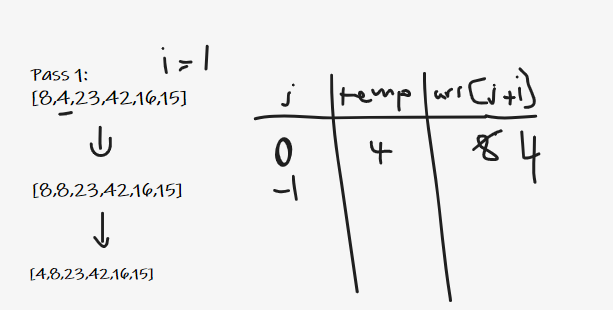
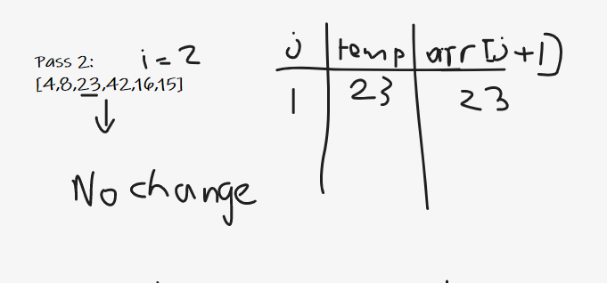
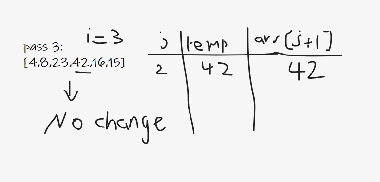
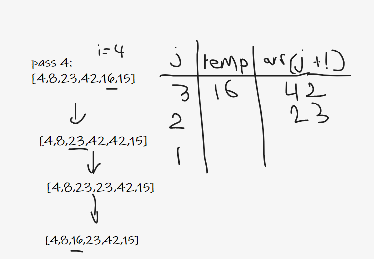
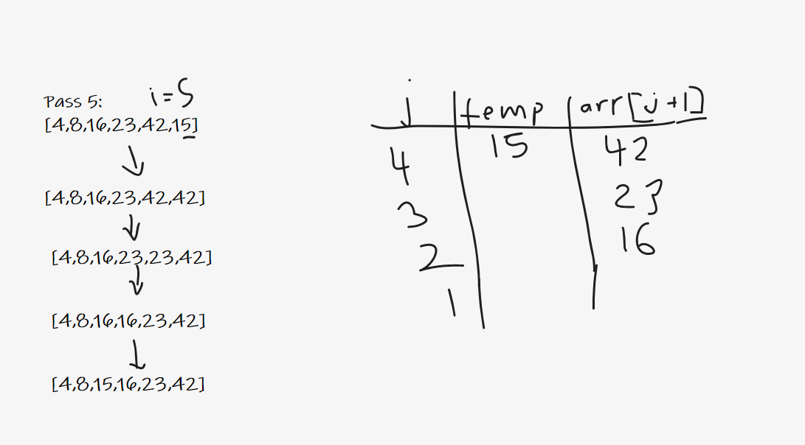

# Steps

We would take the first index as the smallest so we started the counter at 1, i=1. Then we would compare it with the previous value by setting j as i -1 and assign a temp variable to the next index and compare it with woth previous one.
In our case, temp is smaller than `arr[j]` so we will shift the larger value to the right and decrement the value of j by one and then assign the temp in it's right place. When j =0 that means we are at the beginning of the array.

Here we will assign 23 as the temp and when compare it with 8 we find that it's in the right place, so no changes occur.

Also for the 42 it's like the 23 in the right place because it's bigger than 23. No changes occur.

Now 16 is lower than 42, so we will shift the 42 and decrement j by one and also 16 is lower than 23 so we will shift the 23. When we reach 8 the condition will be false and then assert 16 in its right place.

Here as the last step, 15 is lower than 42, so we will shift 15 and lower than 23 and again shift 23 then 16 then it's no more is lower than the previous index (8 < 15). It will be assigned in the right place.

