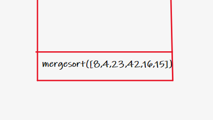
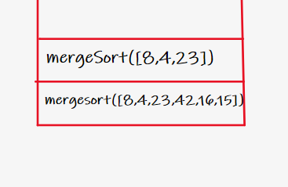
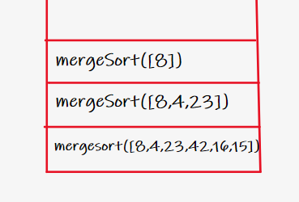
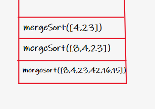
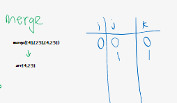
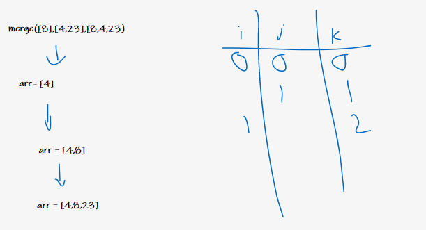
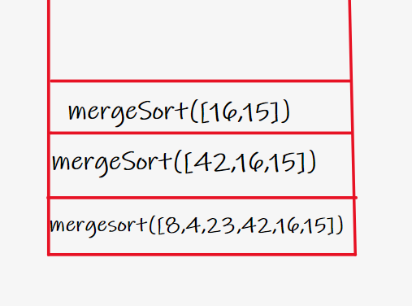
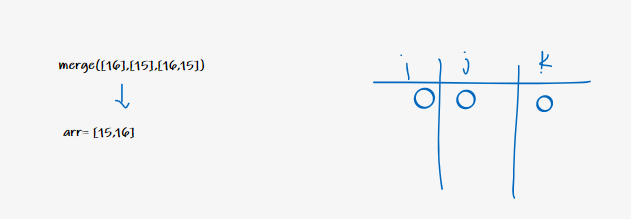
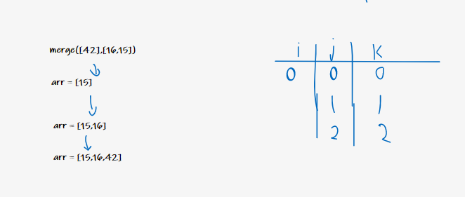
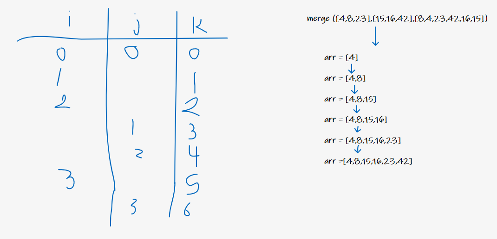

First we will pass the array in merge sort function `mergeSort([8,4,23,42,16,15])` and find the size of it `n=6`, if it's empty or have one index return nothing because in this case it's sorted. else, we will find middle point to start splitting the array `mid=3`. Now, we will split the arrays depending on the middle point of the original array `leftArr = [8,4,23]` `rightArr = [42,16,15]`

We will do the recursion and mergeSort the left part of the array. Find the size of it `n=3`, We will find middle point to start splitting the array `mid=1`. Now, we will split the arrays depending on the middle point of the original array `leftArr = [8]` `rightArr = [4,23]`

Only, one element in the left.

So we will step to the right part of array. Find the size of it `n=2`, We will find middle point to start splitting the array `mid=1`. Now, we will split the arrays depending on the middle point of the original array `leftArr = [4]` `rightArr = [23]`
`merge([4],[23],[4,23])`. No left or right sorting, so we will merge the elements. If the left is lower than right then assign it to the array in k index. In our case, i = 0, j = 0, k = 0, 23 > 4 then arr[0] = 4 and arr[1] = 23.

And now we will merge the ([8],[4,23],[8,4,23]), 8 > 4 so arr[0] = 4 and 8 < 23, arr[1] = 8 and arr[2] = 23.

Now we have right part of array to sort [42,16,15]. Find the size of it `n=3`, We will find middle point to start splitting the array `mid=1`. Now, we will split the arrays depending on the middle point of the original array `leftArr = [42]` `rightArr = [16,15]`

There's no left sorting. In the right sorting, find the size of it `n=2`, We will find middle point to start splitting the array `mid=1`. Now, we will split the arrays depending on the middle point of the original array `leftArr = [16]` `rightArr = [15]`

No left or right sorting, so we will merge the elements. If the left is lower than right then assign it to the array in k index. In our case, i = 0, j = 0, k = 0, 16 > 15 then arr[0] = 15 and arr[1] = 16.

And now we will merge the ([42],[15,16],[42,16,15]), 8 > 4 so arr[0] = 15 and 8 < 23, arr[1] = 16 and arr[2] = 42.

Now we have the left and right side of the original array, we will merge them and have the following result. `arr = [4,8,15,16,23,42]`

