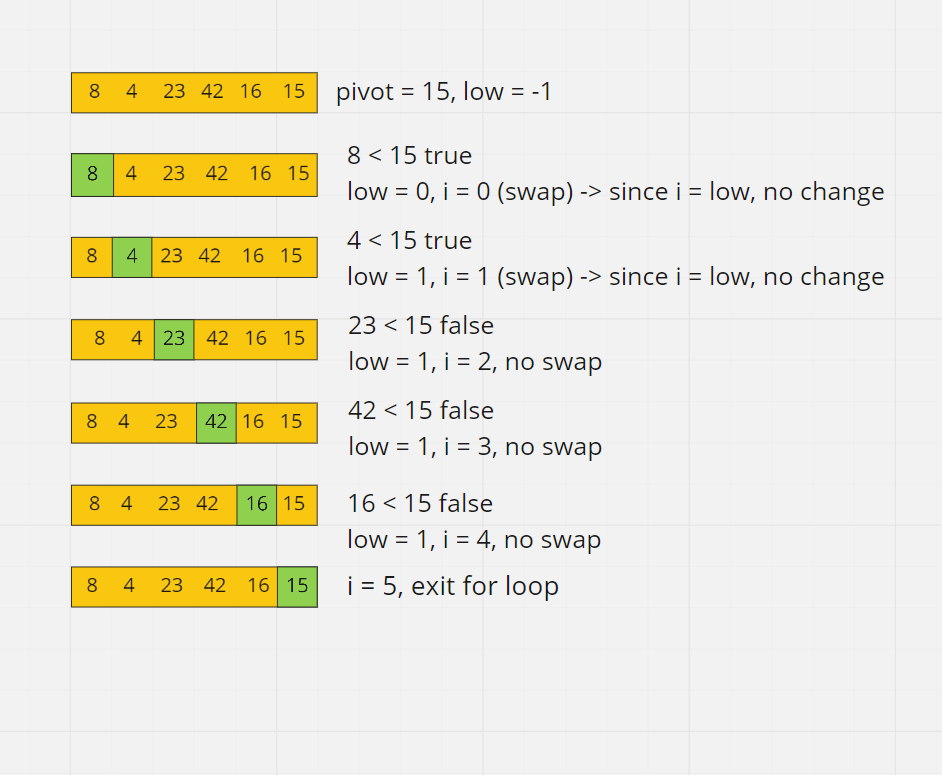
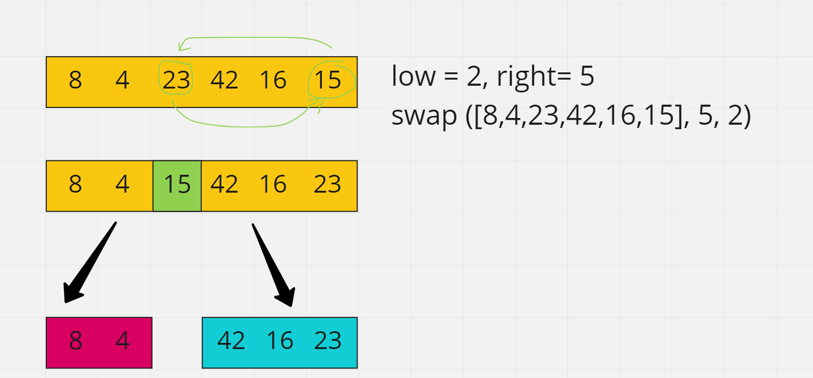

# Quick Sort

Like Merge Sort, QuickSort is a Divide and Conquer algorithm. It picks an element as pivot and partitions the given array around the picked pivot. There are many versions of quickSort that pick pivot in different ways. I'll follow the code provided, and it says the pivot is the last element of the array.

Here is the pseudocode:

```
ALGORITHM QuickSort(arr, left, right)
    if left < right
        // Partition the array by setting the position of the pivot value
        DEFINE position <-- Partition(arr, left, right)
        // Sort the left
        QuickSort(arr, left, position - 1)
        // Sort the right
        QuickSort(arr, position + 1, right)

ALGORITHM Partition(arr, left, right)
    // set a pivot value as a point of reference
    DEFINE pivot <-- arr[right]
    // create a variable to track the largest index of numbers lower than the defined pivot
    DEFINE low <-- left - 1
    for i <- left to right do
        if arr[i] <= pivot
            low++
            Swap(arr, i, low)

     // place the value of the pivot location in the middle.
     // all numbers smaller than the pivot are on the left, larger on the right.
     Swap(arr, right, low + 1)
    // return the pivot index point
     return low + 1

ALGORITHM Swap(arr, i, low)
    DEFINE temp;
    temp <-- arr[i]
    arr[i] <-- arr[low]
    arr[low] <-- temp
```
And Here is the array that I'll implement in the code -> `[8,4,23,42,16,15]`

First, the condition in the quick sort function will check if left is lower than right to ignore invalid indices.
Now, partition function will be implemented by passing the values in it array, left, and right. In the partition function,we need to define the pivot. As I have mentioned earlier, it's the last value in the array. Declare a variable called low that we will use it later in the swap function. Then in the for loop, check whether the arr[i] is lower than the pivot, this step is made to make all the values on the left side of the pivot smaller than pivot when it is in the right place.



Now, we will be back to quicksort and divide the array depending on right place of pivot.



The process will keep going until we finish all the elements in the array.


