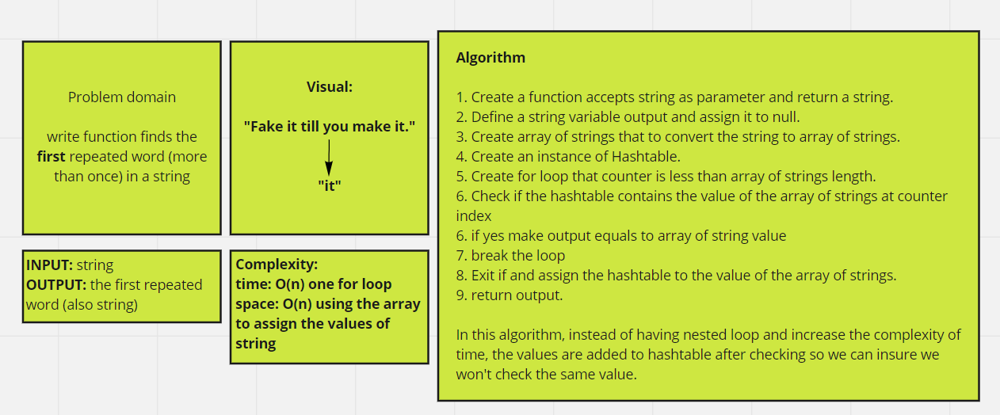
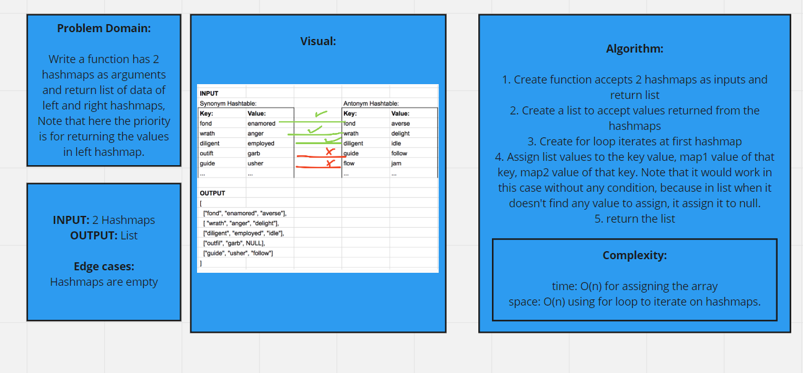

# Hashtables
Hashtable is a data structure that implements an associative array abstract data type, a structure that can map keys to values.

## Challenge
In this challenge we were asked to implement 4 methods:
1. add
   Arguments: key, value
   Returns: nothing

**Note:** This method should hash the key, and add the key and value pair to the table, handling collisions as needed.
2. get
   Arguments: key
   Returns: Value associated with that key in the table

3. contains
   Arguments: key
   Returns: Boolean, indicating if the key exists in the table already.
4.
5. hash
   Arguments: key
   Returns: Index in the collection for that key

## Approach & Efficiency
In add method, complexity was:
space: O(1) only adding new node to the array.
time: O(n) while searching if key exist in the linked list

In get method, complexity was:
space: O(1) only one variable is used for hashing
time: O(n) while searching if key exist in the linked list

In contain method, complexity was:
space: O(1) only one variable is used for hashing
time: O(n) while searching if key exist in the linked list or not

In hash method, complexity was:
space: O(1) only one variable is used for hashing
time: O(1) only one variable is saved in the memory (finding hash value)

# Code Challenge 31
We were asked to create a function returns the first repeated value of an input string

## Whiteboard Process

# Code Challenge 33
We were asked to create a function returns list of two gathered hashmaps that have some common keys

## Whiteboard Process

