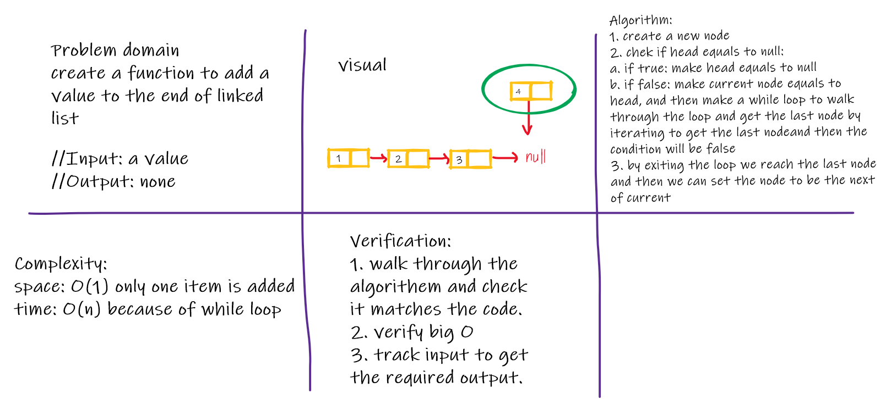
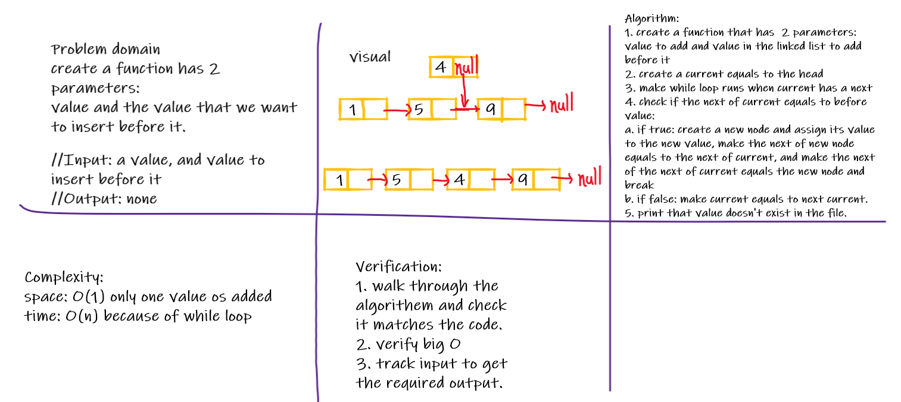
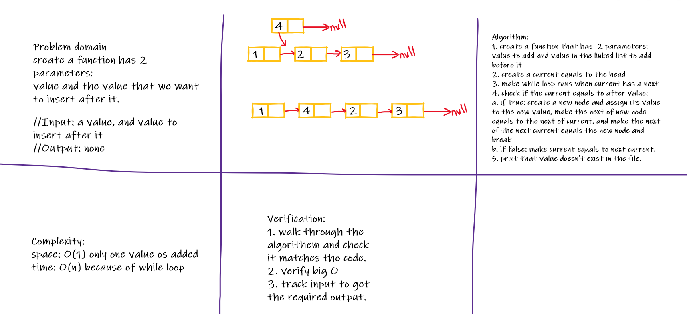
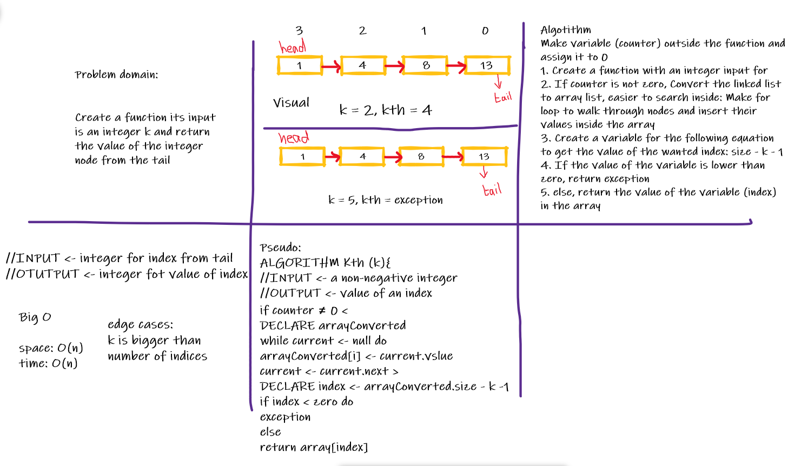

Code challenge 06

# Insertions

1. Insert at the end of the linked list by providing the value to insert.
2. Insert a value before a specified value by giving the value to insert and the value to insert before it. Check if the value to insert before does exist!
3. Insert a value before a specified value by giving the value to insert and the value to insert after it. Check if the value to insert after does exist!

## Whiteboard Process

Code Challenge 07

# kth from the tail function

I have used array list because its easier for searching
## Whiteboard Process

