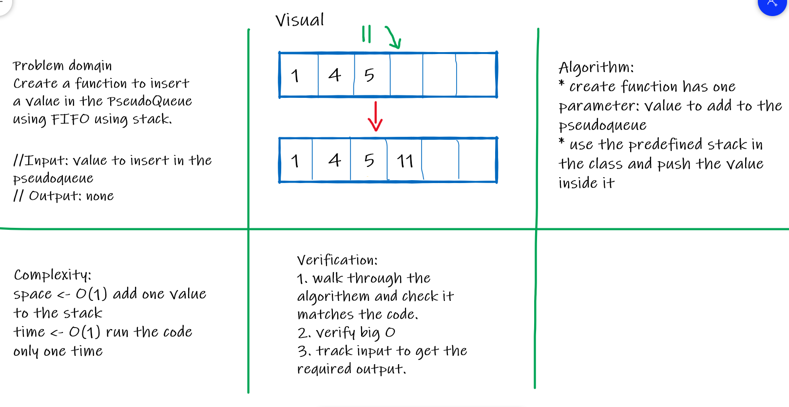
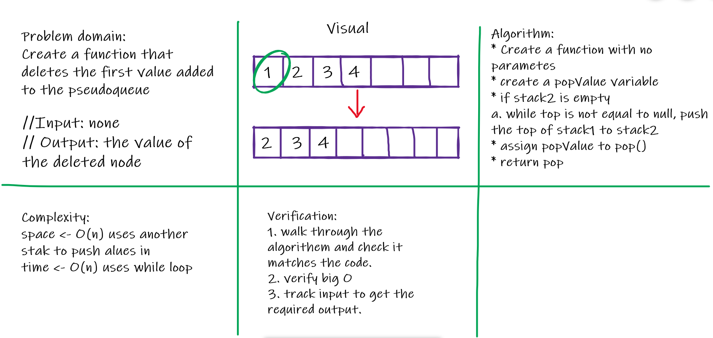

Code Challenge 10

# Stacks and Queues

Stack uses FILO/LIFO concept: First In Last Out/Last In First Out. It has **one** side to deal with: top.
Queue uses FIFO/LILO concept. First In First Out/Last In Last Out. It has **two** sides to deal with: front & back (rear).

## Challenge
In this challenge, we were asked to create a method to insert a value in the stack and delete the last value entered the stack. Also to get the peek of the stack and declare whether it's empty or not.
1. push()
2. pop()
3. peek()
4. isEmpty()

Also for the queue, it was required to insert a value in the queue and delete the first value inserted in the queue, find the peek and determine whether the queue is empty or not.
1. enqueue()
2. dequeue()
3. peek()
4. isEmpty()

## Approach & Efficiency
I created class for the node and import it to queue and stack classes and set their methods their.
Stack:
1. push() -> space <- O(1), time <- O(1)
2. pop() -> space <- O(1), time <- O(1)
3. peek() -> space <- O(1), time <- O(1)
4. isEmpty() -> space <- O(1), time <- O(1)

Queue:
1. enqueue() -> space <- O(1), time <- O(1)
2. dequeue() -> space <- O(1), time <- O(1)
3. peek() -> space <- O(1), time <- O(1)
4. isEmpty() -> space <- O(1), time <- O(1)

Code Challenge 11

# Challenge Summary
This code challenge asked for dealing with stack as queue. Use stack methods to simulate queue methods and properties

## Whiteboard Process

