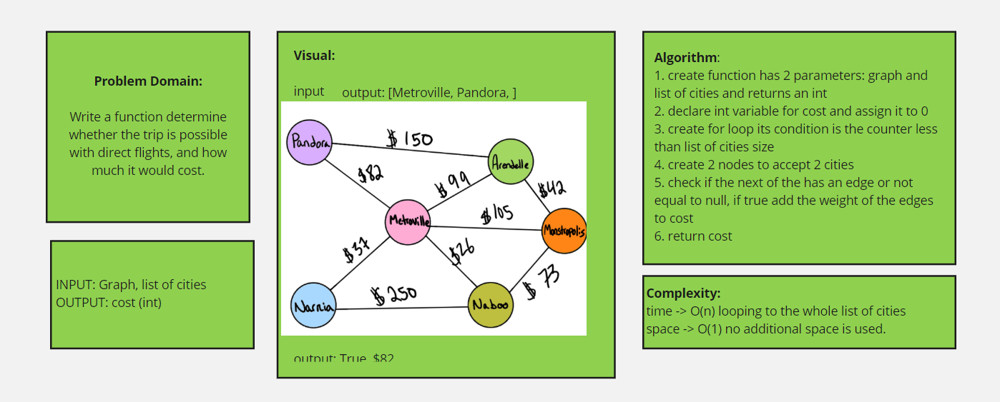
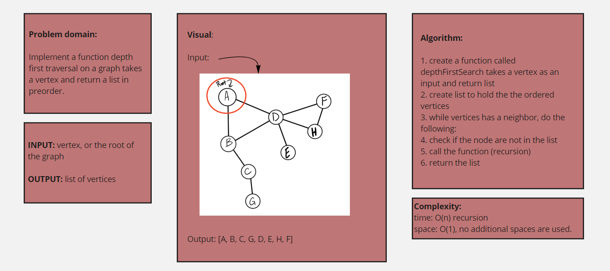

### challenge 37
*Write a function called business trip Determine whether the trip is possible with direct flights, and how much it would cost.

### WhiteBoard

### challenge 38
*Write a function called depthFirstSearch returns the vertices in list ordered in preoder. 

### WhiteBoard

