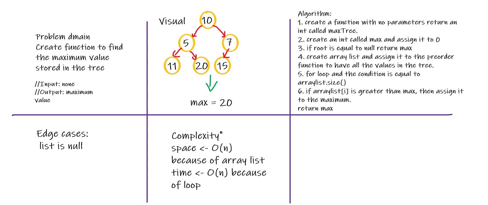

# Code Challenge 15

## Trees
<!-- Short summary or background information -->
Trees are a collection of nodes (vertices), and they are linked with edges (pointers), representing the hierarchical connections between the nodes.

## Challenge
<!-- Description of the challenge -->
We were asked to create methods would arrange the trees in special order: preorder, inorder, postorder.
Also, to create methods to deal with adding new nodes to their correct place and search for values in the tree.

## Approach & Efficiency
<!-- What approach did you take? Why? What is the Big O space/time for this approach? -->
In creating add and contain methods, both of them I used breadth first.

**Complexity**

add method:
1. space <- O(1)
2. time <- O(n)

contain method:
1. space <- O(1)
2. time <- O(n)

# Code Challenge 16

## Tree Maximum
In this code challenge we were asked to find the maximum value in the tree.

## Whiteboard Process

